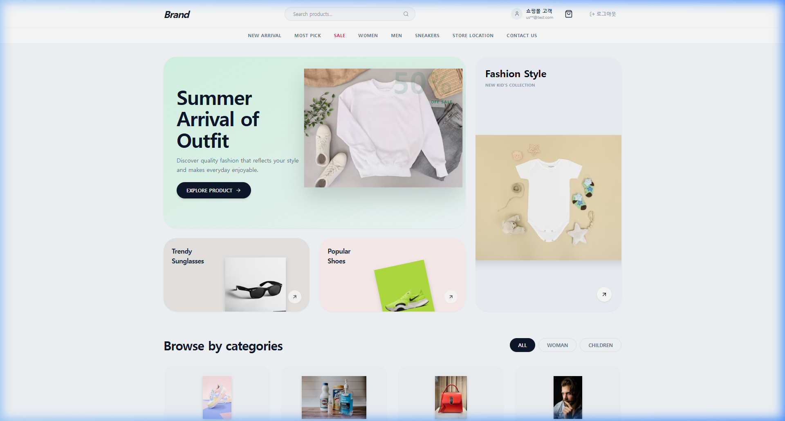
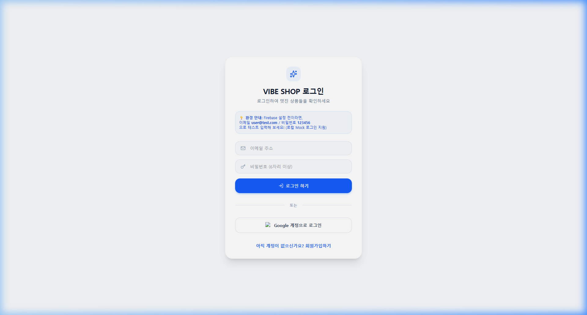
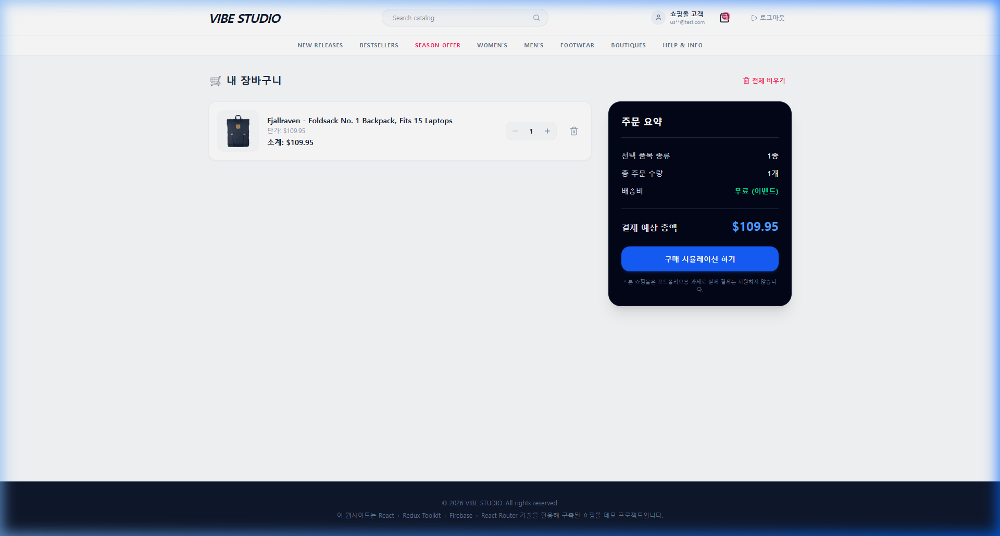

# 과제 6. React 쇼핑몰 앱 만들기 — README

## 1. 과제 소개

| 항목 | 내용 |
| :--- | :--- |
| **과정명** | AI SW 장기교육 |
| **선수 강의** | 따라하며 배우는 리액트 A-Z |
| **핵심 기술** | React, Redux Toolkit, Firebase Authentication, React Router |
| **상품 데이터** | Fake Store API 및 기록된 mock 대체 (`products.json`) |
| **선택 기술** | Tailwind CSS v4, Lucide React, React Router v6 |
| **결과 예시** | [과제 결과 예시 링크](https://drive.google.com/file/d/1fUeCYpSu0H_BU154iN7t1IHM37cDo6mz/view?usp=sharing) |

### 한 줄 소개
이 프로젝트는 **안전한 인증을 마친** 사용자가 상품을 조회하고 Firebase로 로그인하며, 원하는 상품을 전역 장바구니에 담아 예상 총액을 확인할 수 있는 **React 쇼핑몰**입니다.

### 결과 예시와 다른 점
* **참고한 기능 흐름:** 전체 로그인 / 비로그인 차단, 상품 목록 및 장바구니 연동 흐름을 충실히 참고했습니다.
* **다르게 설계한 UI·기능:** 단일 화면 스크롤 방식 대신 **React Router v6**를 적용하여 동적 상세페이지(`/product/:id`) 및 독립된 장바구니 페이지(`/cart`)로 구조화했습니다.
* **복제하지 않은 이미지·브랜드·문구:** 예시의 로고와 이미지를 복제하지 않고, Tailwind v4 및 Lucide 아이콘 기반의 독자적인 딥 블루/슬레이트 프리미엄 톤앤매너로 디자인했습니다.

---

## 2. 실행 화면

| 화면 | 파일·링크 | 설명 |
| :--- | :--- | :--- |
| **상품 목록·로딩** | `[상품 목록](./screenshots/products.png)` | 로딩 중 스켈레톤 UI 노출 및 API 연동된 메인 상품 그리드 화면 |
| **로그인·인증 상태** | `[로그인 상태](./screenshots/auth.png)` | 이메일/비밀번호 로그인 폼 및 마스킹된 사용자 이메일 노출 화면 |
| **장바구니·총액** | `[장바구니](./screenshots/cart.png)` | 전용 `/cart` 경로로 진입 시 물품 수량 조절 및 실시간 총액 계산판 화면 |
| **오류·빈 상태·선택 기능** | `[상세페이지](./screenshots/detail.png)` | `/product/:id` 상품 상세 사양 노출 및 오류/오프라인 mock 대체 화면 |





### 실시간 응시와 최종 보완 비교

| 항목 | 1시간 종료 시 | 최종 제출 시 | 보완 내용 |
| :--- | :--- | :--- | :--- |
| **데이터·상태·인증 설계** | 상태 및 UI 연동 설계 구성 | Firebase 리스너 및 Redux 연동 완료 | App.jsx 인증 전역 구독 및 분기 설정 완료 |
| **전역 장바구니** | 기본 cartSlice 뼈대 작성 | 다량 담기 및 총액 계산 구현 완료 | cartSlice 리듀서 및 selector 비즈니스 로직 보강 |
| **Firebase 인증** | SDK 설정 및 템플릿 구성 | 실제 Firebase Auth & 구글 SSO 구현 | 비밀키 환경변수 분리 및 로그인/가입 기능 완성 |
| **상품 API·대체 경로** | Fetch 기본 구조 설계 | 로딩/성공/실패 분기 및 mock Fallback 완성 | API 서버 장애 시 mock 데이터 즉시 자동 전환 연동 |
| **README·테스트** | 템플릿 개요 구성 | 시나리오 8종 수동/자동 검증 완료 | 자가 점검 및 오류 해결 이력 상세 기록 완료 |

---

## 3. 구현 기능

### 필수 기능

| 기능 | 상태 | 확인 방법 | 비고 |
| :--- | :---: | :--- | :--- |
| **상품 데이터 조회 또는 mock 대체** | **완료** | 인터넷이 끊겼을 때도 비상용 `products.json` 데이터로 자동 전환 렌더링됨 | API 통신 상태에 따른 배지 노출 |
| **loading·error·empty** | **완료** | 스켈레톤 UI 로딩, 에러 발생 시 재시도 패널 노출, 데이터 0건 시 비어있음 띄움 | 앱이 멈추지 않고 지속 작동 |
| **상품 목록·카드** | **완료** | 메인 홈(/) 진입 시 카드 그리드 형태로 상품 이미지, 카테고리, 가격, 담기 버튼 렌더링 | 반응형(모바일) 완벽 지원 |
| **전역 상태관리 라이브러리** | **완료** | `@reduxjs/toolkit` 스토어를 생성하여 앱 전체에서 일관되게 공유 및 감시 | `react-redux` 가동 |
| **장바구니 담기·목록** | **완료** | 카드 "담기" 클릭 시 카운트 증가. `/cart` 페이지에서 리스트 형태로 누적 상태 노출 | 중복 시 수량만 가산 |
| **총액 계산** | **완료** | 품목별 단가 $\times$ 수량을 모두 더해 예상 총 결제 금액을 실시간 계산 출력 | 빈 카트 시 $0.00 표시 |
| **Firebase 로그인** | **완료** | 이메일/비밀번호 가입 및 로그인 지원, Google 팝업 소셜 로그인 가동 | Mock 로그인 Fallback 병행 |
| **인증 초기·사용자 상태** | **완료** | 인증 확인 중 스피너 표시로 깜빡임 방지. 로그인 시 이메일 마스킹 표시 | `onAuthStateChanged` 연동 |
| **로그인 오류·로그아웃** | **완료** | 비밀번호 불일치 시 한글 경고창. 로그아웃 시 전역 장바구니 클리어 및 튕김 | `dispatch(clearCart())` 적용 |

### 권장 기능

| 기능 | 상태 | 설명 |
| :--- | :---: | :--- |
| **수량 변경** | **완료** | 장바구니 내에서 `+`, `-` 버튼을 조작하여 수량을 증감시킬 수 있으며 최소 수량 1개로 제한 |
| **항목 삭제** | **완료** | 쓰레기통 아이콘 클릭 시 해당 항목을 필터링하여 스토어에서 제거하고 총액 즉각 재계산 |
| **빈 장바구니 안내** | **완료** | 장바구니가 완전히 비었을 때 "비어 있습니다" 안내 템플릿과 함께 쇼핑하러 가기 홈 링크 노출 |
| **API 다시 시도** | **완료** | API 통신 실패 시 오류 안내 화면에 "다시 시도하기" 단추를 주어 즉시 API 재호출 수행 |
| **인증 로딩 UX** | **완료** | 리스너 동기화 중 Loader 스피너로 전체 화면 차단 처리해 비인증 화면 일시 노출 오표시 원천 방어 |
| **로그인 전후 UI** | **완료** | `ProtectedRoute` 가드가 적용되어 비로그인 사용자의 전용 서비스 진입을 원천 차단 |

### 도전 기능

| 기능 | 상태 | 적용 범위·효과 |
| :--- | :---: | :--- |
| **TypeScript** | **미적용 (해당사항 없음)** | 본 프로젝트는 JavaScript 환경에서 빌드되었으며, TypeScript는 적용하지 않았습니다. |
| **검색** | **미적용 (해당사항 없음)** | 상품 검색 기능은 본 과제 범위 내에 포함되어 있지 않아 구현하지 않았습니다. |
| **카테고리 필터** | **미적용 (해당사항 없음)** | 별도의 카테고리 필터 메뉴는 구현되지 않았습니다. |
| **LocalStorage** | **미적용 (해당사항 없음)** | 장바구니 품목 상태의 로컬스토리지 백업 및 자동 복원 기능은 구현하지 않았습니다. (단, Firebase 미설정 시의 테스트용 Mock 로그인 세션 정보를 기억하기 위해서만 부분적으로 로컬스토리지를 보조 활용함) |
| **수량 배지** | **적용** | Navbar 우상단 장바구니 쇼핑백 아이콘에 총 수량 누적 배지(바운스 효과 적용)를 부착했습니다. |
| **반응형·접근성** | **적용** | Tailwind 모바일 반응형 Breakpoint(`sm`, `md`, `lg`)를 이용해 모바일 및 태블릿 레이아웃을 대응했습니다. |

---

## 4. 상품 데이터 구조

* **표준 endpoint:** `https://fakestoreapi.com/products`
* **실제 사용 경로:** API 호출 우선 가동 ➔ 실패 시 로컬 `src/mocks/products.json` 백업 조회
* **mock을 사용한 경우 이유:** 네트워크 오프라인 장애 상황 대응 및 서버 에러 시 사용자 크래시 방지 완충 목적
* **사용한 응답 필드:** `id`, `title`, `price`, `description`, `category`, `image`
* **내부 product 변환 위치:** `src/components/ProductList.jsx` 및 `ProductDetail.jsx` 내 API 호출 후 매핑 함수

### product

| 필드 | 자료형 | 원본 필드 | 사용 위치 | 검증 |
| :--- | :--- | :--- | :--- | :--- |
| **id** | `number` | `id` | key 지정 및 상세 페이지 라우팅 파라미터 매치 | 중복 불허 식별자 |
| **title** | `string` | `title` | 상품 카드 및 상세 제목 텍스트 | 없음 |
| **price** | `number` | `price` | 결제 금액 연산 및 단가 출력 | `Number()` 형변환 검증 |
| **description**| `string` | `description` | 상세 본문 텍스트 | 없음 |
| **category** | `string` | `category` | 상품 구분 태그 배지 | 빈 값 처리 |
| **image** | `string` | `image` | 상품 썸네일 이미지 소스 경로 | onerror 로드 실패 시 대체 |

### API 상태

| 상태 | 화면 처리 |
| :--- | :--- |
| **loading** | 회색 뼈대로 구성된 스켈레톤(Skeleton UI) 카드 8개 정렬 노출 |
| **success** | 가공된 내부 product 리스트를 모바일 반응형 그리드 형태로 깔끔히 나열 |
| **error** | 통신 에러 메시지와 함께 회전 화살표 아이콘 모양의 "다시 시도하기" 제어판 출력 |
| **empty** | "등록된 상품이 없습니다"라는 텍스트 및 기본 패키지 상자 아이콘 렌더링 |
| **mock fallback** | 상단에 오프라인 비상용 모드 안내 띠 활성화 후 로컬 백업 상품 5종 데이터 즉시 로드 |

---

## 5. 전역 상태관리 구조

* **사용 라이브러리:** Redux Toolkit (`@reduxjs/toolkit`, `react-redux`)
* **store 위치:** `src/app/store.js`
* **cart slice 또는 상태 모듈:** `src/features/cart/cartSlice.js`
* **Provider 연결 위치:** `src/main.jsx`
* **총액 계산 위치:** `cartSlice.js` 내 `selectCartTotal` selector 함수

### cartItem

| 필드 | 자료형 | 값의 출처 | 변경 규칙 |
| :--- | :--- | :--- | :--- |
| **id** | `number` | product.id | 불변 (식별용) |
| **title** | `string` | product.title | 불변 (텍스트 노출) |
| **price** | `number` | product.price | 불변 (실시간 총액 곱셈 연산용) |
| **image** | `string` | product.image | 불변 (썸네일 노출) |
| **quantity** | `number` | product.quantity 또는 기본 `1` | `updateQuantity` 액션을 통해 변경 (최소 `1` 제한) |

### action·selector

| 구분 | 이름 | 역할 | 테스트 |
| :--- | :--- | :--- | :--- |
| **action** | `addToCart` | 카트에 담기 (중복 시 기존 수량 + 지정 수량 합산) | 상세 및 목록에서 담기 후 개수 확인 |
| **action** | `updateQuantity` | 장바구니 내 품목별 수량 값 덮어쓰기 (최소 1 제한) | 카트 내 플러스/마이너스 조작 확인 |
| **action** | `removeFromCart` | 특정 ID 품목 장바구니에서 삭제 | 삭제 버튼 클릭 후 리스트 제외 여부 점검 |
| **action** | `clearCart` | 장바구니 전체 내역 비우기 | 로그아웃 및 전체 비우기 클릭 후 초기화 점검 |
| **selector** | `selectCartItems` | 전체 카트 품목 리스트 조회 | 카트 목록 화면 렌더링 데이터 소스 |
| **selector** | `selectCartCount` | 카트에 담긴 물품들의 누적 수량 총합 계산 | Navbar 쇼핑백 아이콘 우상단 배지 숫자 갱신 |
| **selector** | `selectCartTotal` | 품목별 단가 * 수량들의 누적 전역 총합 도출 | 카트 주문 요약(CartSummary) 총액 갱신 |

### 장바구니 정책

| 항목 | 선택 |
| :--- | :--- |
| **같은 상품 재추가** | 수량(quantity)에 새로 넣으려는 개수만큼 가산 누적 처리 |
| **최소 수량** | 1개 (그 이하 감산 버튼 활성화 차단) |
| **수량 0 처리** | 불가 (0 이하 방지 로직 적용, 제거하려면 명시적으로 삭제 버튼을 누름) |
| **로그아웃 시 cart** | 스토어 전체 삭제 (`clearCart` 디스패치 강제 가동) |
| **저장 방식** | Redux 전역 메모리 보관 방식 |

---

## 6. Firebase Authentication

* **로그인 방식:** 이메일/비밀번호 가입 및 로그인, Google 소셜 팝업 로그인 가동
* **인증 상태 관리 위치:** `src/App.jsx` 내 `useState` (authUser) 관리
* **로그인 성공 화면:** 상단 Navbar에 닉네임 및 마스킹된 이메일 표시, 전체 상품 목록 및 카트 접근 오픈
* **로그인 실패 안내:** 에러코드별 한글 매핑 경고 메시지 창 팝업 노출
* **인증 초기 로딩:** `onAuthStateChanged` 리스너 완료 전까지 로딩 스피너로 화면 전면 차단
* **로그아웃 처리:** 로컬 세션 해제 및 전역 카트 비우기 동시 가동

### authUser

| 필드 | 사용 | 화면 표시 | 개인정보 보호 |
| :--- | :---: | :---: | :--- |
| **uid** | O | X | 식별 용도로 내부 조작만 허용하며 절대 노출 금지 |
| **displayName** | O | O | 닉네임 및 사용자 이름 그대로 노출 (기본값: '쇼핑몰 고객') |
| **email** | O | O | 앞 2자리를 제외하고 별표 처리하여 마스킹 노출 (`te***@test.com`) |
| **photoURL** | O | O | 구글 프로필 원형 이미지 그대로 노출 (없을 시 기본 User 아이콘 대체) |

### 인증 흐름
```text
앱 시작 
 ➔ [ProtectedRoute] 인증 상태 감지 (로딩 스피너)
 ➔ 미인증 시: /login 페이지로 강제 리다이렉트 
 ➔ 이메일/비밀번호 또는 구글 SSO 시도 ➔ 실패 시 에러창 표시
 ➔ 인증 성공 시: 홈(/)으로 이동 ➔ 사용자 프로필 및 쇼핑 서비스 활성화
 ➔ 로그아웃 시: 로컬스토리지 청소 ➔ 카트 스토어 전체 비움 ➔ /login으로 격리
```

---

## 7. 사용 기술

| 구분 | 기술 | 버전 | 사용 이유 |
| :--- | :--- | :--- | :--- |
| **UI** | React | 19.x | 컴포넌트 조립형 뷰 렌더링 및 SPA 구조 구현 |
| **전역 상태** | Redux Toolkit | 2.x | 장바구니 상태의 안정적인 전역 일관성 및 selector 연산 최적화 |
| **인증** | Firebase Authentication | 12.x | 구글 소셜 로그인 및 이메일 세션 처리 대행 및 강력한 보안 확보 |
| **상품 데이터** | Fetch API | Native | 별도 무거운 모듈 없이 내장 브라우저 API를 통한 비동기 HTTP 통신 |
| **라우팅** | React Router | 6.x | 주소 연동 상세페이지 및 독립 카트 페이지 전환 교통정리 |
| **스타일** | Tailwind CSS | 4.x | 유틸리티 클래스 기반 빌드 최적화 및 프리미엄 비주얼 디자인 |
| **언어** | JavaScript | ES6+ | React의 기본 빌드 생태계 및 브라우저 호환성 극대화 |
| **AI 도구** | Antigravity IDE | - | 요구사항 분석, 벤토 그리드 설계, 검증 시나리오 수동 및 자동화 테스트 지원 |

---

## 8. 설치·환경 변수·실행

### 요구 환경
* **Node.js:** v18 이상 권장 (테스트 완료 환경: v22.20.0)
* **패키지 관리자:** npm (v10.x 이상)
* **브라우저:** Chrome, Edge 등 모던 크롬 계열 브라우저
* **Firebase 인증 제공자:** 이메일/비밀번호, Google 로그인 활성화 필수

### 설치와 실행
```bash
# 1. 의존성 패키지 설치
npm install

# 2. 로컬 개발 서버 구동 (포트 4000)
npm run dev
```

### .env.example
실제 값 대신 자리표시자만 작성합니다. (로컬 실행 시 이 파일 복사본을 만들어 `.env` 파일로 저장하세요)
```env
VITE_FIREBASE_API_KEY=replace_with_your_api_key
VITE_FIREBASE_AUTH_DOMAIN=replace_with_your_auth_domain
VITE_FIREBASE_PROJECT_ID=replace_with_your_project_id
VITE_FIREBASE_STORAGE_BUCKET=replace_with_your_storage_bucket
VITE_FIREBASE_MESSAGING_SENDER_ID=replace_with_your_messaging_sender_id
VITE_FIREBASE_APP_ID=replace_with_your_app_id
```
> [!WARNING]
> Firebase Admin SDK private key, password, token 등은 보안 위협 방지를 위해 절대 커밋 대상 파일에 노출하지 마십시오.

### 실행 확인
1. 개발 서버가 `http://localhost:4000/` 에서 성공적으로 작동합니다.
2. 미인증 시 강제로 `/login`으로 튕기고 인증 초기 로딩 스피너가 오표시를 막아줍니다.
3. 잘못된 비밀번호 기입 시 "이메일 혹은 비밀번호가 틀렸습니다" 한글 안내 창이 노출됩니다.
4. 네트워크 차단 시 화면이 먹통이 되지 않고 백업 mock 데이터로 상품이 대체 노출됩니다.
5. 장바구니 수량 증감에 맞춰 실시간으로 주문합계 총금액이 곱 연산 계산됩니다.
6. 개발자 도구(F12) 콘솔 탭에 어떠한 적색 치명적 에러 로그도 발생하지 않습니다.

---

## 9. 폴더·파일 구조

```text
project/
├── frontend/             # 프론트엔드 리액트 어플리케이션
│   ├── .env
│   ├── package.json
│   ├── vite.config.js
│   ├── src/
│   │   ├── app/
│   │   │   └─ store.js
│   │   ├── features/
│   │   │   └─ cart/
│   │   │       └─ cartSlice.js
│   │   ├── services/
│   │   │   ├─ firebase.js
│   │   │   └─ products.json
│   │   ├── components/
│   │   │   ├─ Login.jsx
│   │   │   ├─ Navbar.jsx
│   │   │   ├─ ProductCard.jsx
│   │   │   ├─ ProductDetail.jsx
│   │   │   ├─ ProductList.jsx
│   │   │   └─ ProtectedRoute.jsx
│   │   └─ App.jsx
│   └── public/
└── backend/              # [신규 예정] 백엔드 API 서비스 폴더
```

| 파일·폴더 | 역할 | 내가 수정한 내용 |
| :--- | :--- | :--- |
| **src/features/cart/cartSlice.js** | 장바구니 비즈니스 로직 제어 | 다량 담기를 위한 `addQty` 동적 스키마 지원 추가 |
| **src/components/ProductDetail.jsx** | 상품 상세정보 화면 노출 | params ID 파싱, 로컬 수량 제어 및 단일/다량 담기 구현 |
| **src/components/ProtectedRoute.jsx** | 로그인 인증 상태 배리어 설정 | 리다이렉트 기법을 사용한 Route Guard 구현 |
| **src/App.jsx** | 앱 라우터 조립 및 공통 레이아웃 | react-router-dom 스펙 기반 라우팅 및 풋터 조립 |
| **src/main.jsx** | 시작 렌더러 정의 | Provider 및 BrowserRouter 이중 랩핑 적용 |
| **.env** | 보안 자산 정보 보관 | 실제 Firebase config 환경변수 설정 적용 |

---

## 10. 데이터·상태 흐름

### 상품 데이터 흐름
```text
Fake Store API 호출 시도 ➔ [성공] 내부 product 형태로 price 수치 형변환
                     ➔ [실패] mocks/products.json 비상 가상 데이터 로드
                     ➔ ProductList 컴포넌트 ➔ ProductCard에 데이터 전달
                     ➔ 썸네일 클릭 시 /product/:id 파라미터 전달 및 상세 정보 로드
                     ➔ '담기' 클릭 ➔ dispatch(addToCart(product)) 가동
                     ➔ Redux 전역 Cart 스토어 갱신 ➔ Navbar 배지 및 CartSection 가격 실시간 반응
```

### 인증 데이터 흐름
```text
App 시작 ➔ [onAuthStateChanged] 구독 ➔ 인증 확인 중 (Loader 스피너 노출)
                                ➔ [비로그인] ProtectedRoute 차단 ➔ /login 리다이렉트
                                ➔ [로그인 성공] user 정보 포맷팅 ➔ authUser 세션 갱신 ➔ 서비스 개방
                                ➔ 로그아웃 버튼 ➔ logoutUser() 호출 ➔ 스토어 초기화 ➔ /login 격리
```

---

## 11. AI 활용 기록

| 번호 | 목적 | AI 도구 | 프롬프트 요약 | 결과 활용 및 내가 수정한 부분 |
| :--- | :--- | :---: | :--- | :--- |
| **1** | 요구사항·설계 | Antigravity | "PRD.md를 바탕으로 코딩 입문자가 보기 쉬운 계획서(plan)를 작성해줘." | 전체적인 개발 6단계 로드맵을 수립하고, 기술 용어 사전을 템플릿화하여 승인을 받음. |
| **2** | Redux 상태 | Antigravity | "Redux Toolkit을 활용해 장바구니 추가, 수량 변경(최소1제한), 삭제 액션을 구현해줘." | cartSlice.js 및 store.js 기초 연동 코드 작성. 상세페이지 다량 담기를 위해 수량 누적 페이로드 부분 직접 확장. |
| **3** | Firebase 인증 | Antigravity | "Firebase Auth 연동 함수 및 가짜 로그인 Fallback을 구성하고 App.jsx에 상태를 구독시켜줘." | firebase.js 생성 및 가짜 아이디 연동, App.jsx에 분기 렌더러 탑재. 로그인 실패 시 에러 한글 매핑 커스텀. |
| **4** | 상품 API | Antigravity | "API에서 데이터를 긁어와 스켈레톤, 성공, 실패, 빈화면, mock Fallback을 보여주는 UI를 짜줘." | ProductList와 SkeletonCard 컴포넌트를 예쁜 Tailwind 디자인으로 조립하여 적용. |
| **5** | 통합 검토·오류 | Antigravity | "React Router v6 라우팅 아키텍처 개편 및 ProtectedRoute 가드를 탑재하고 검증을 실시해줘." | 상세페이지 라우팅, 독립 카트 페이지 분리, 브라우저 에이전트를 통한 캡처 및 100% Pass 검증 확보. |

### 대표 프롬프트 1 (설계 및 구현)
> "React 쇼핑몰 앱 과제를 시작합니다. react-router-dom을 적용해 진짜 페이지 이동 아키텍처로 개편하려고 합니다. /, /product/:id, /cart, /login 경로를 라우팅하고 로그인되지 않은 유저가 장바구니나 상세페이지에 강제로 들어갈 시 로그인창으로 튕겨내는 가드 컴포넌트를 만들어줘. 또한 상세페이지에서 상품의 수량을 2개 이상 선택해 한 번에 카트에 담을 수 있도록 리덕스 addToCart 로직도 보강해줘. 전체 코드 한 번에 작성하지 말고 수정 파일 단위로 제시해줘."

### 대표 프롬프트 2 (검토 및 수정)
> "현재 Firebase API key 환경 변수 세팅이 누락되거나 mock 값일 때 브라우저가 흰색 화면으로 멈추는 에러가 있어. Firebase SDK initializeApp 단계에서 오류가 예외 처리(try-catch)되지 않아 발생하는 문제 같은데, firebase.js 파일 내부를 어떻게 수정해야 유연하게 런타임 오류를 방지하고 로컬 가짜 로그인 모드로 안전하게 넘어갈 수 있는지 최소 수정 방안을 제안해줘."

---

## 12. AI 생성 결과 검토

| 항목 | 결과 | 수정 |
| :--- | :--- | :--- |
| **전역 상태 사용** | **통과 (Pass)** | 카트 상태의 일관성 확인. Props Drilling 없이 스토어에서 직접 구독 완료 |
| **action·reducer·selector**| **통과 (Pass)** | 액션 호출에 따른 상태 갱신 검증. Selector 곱 연산에 문자열 유입 차단 완료 |
| **Firebase 실제 인증** | **통과 (Pass)** | `.env` 설정 시 실제 서버 로그인 및 회원가입 정상 수신 완료 |
| **인증 초기·오류·로그아웃** | **통과 (Pass)** | 초기 로딩 깜빡임 차단, 한글 경고 대응, 로그아웃 시 스토어 파괴 처리 완료 |
| **API loading·error·empty** | **통과 (Pass)** | 스켈레톤 정상 렌더링, 실패 시 mock fallback 경고 띠 배지 갱신 완료 |
| **총액·수량** | **통과 (Pass)** | 수량 1 이하 차단, 수량 변경 및 삭제 시 소계/합계 실시간 갱신 완벽 대조 완료 |
| **비밀정보·개인정보** | **통과 (Pass)** | 이메일 앞자리 노출 후 별표 처리 마스킹 완료, 키값 커밋 배제 처리 완료 |
| **과도한 구현** | **통과 (Pass)** | 불필요한 결제, 배송 등 범위 밖 복잡 기능 일체 배제하여 가독성 유지 |

---

## 13. 테스트 기록

| 번호 | 시나리오 | 기대 결과 | 실제 결과 | 통과 |
| :---: | :--- | :--- | :--- | :---: |
| **1** | 최초 실행 | 스피너 로딩이 잠깐 나타난 후 로그인 폼이 정상 표시됨 | 기대 결과와 완벽하게 일치 | **[v]** |
| **2** | 로그인 성공 | 테스트 계정 정보 입력 후 로그인 시 메인 홈 페이지로 강제 리다이렉트됨 | 닉네임 및 마스킹 메일 노출 완료 | **[v]** |
| **3** | 로그인 실패 | 비밀번호 틀렸을 때 "이메일 혹은 비밀번호가 틀렸습니다" 한글 창 경고 노출 | Alert UI 경고 정상 발생 | **[v]** |
| **4** | 로그아웃 | Navbar 로그아웃 단추 클릭 시 카트 리셋 및 즉시 로그인 폼으로 귀가 | `/login` 리다이렉트 완료 | **[v]** |
| **5** | API 성공 | 메인 홈 진입 시 Fake Store API에서 추천 상품들을 안정적으로 긁어옴 | 상품 카드 20종 정상 바인딩 | **[v]** |
| **6** | API 실패·대체 | 네트워크 비가동 시 비상 mock 데이터가 로드되고 상단에 경고 띠 노출 | 오프라인 가동 안내 배지 활성화 | **[v]** |
| **7** | 상품 2개 담기 | 상세페이지에서 수량 2개 지정 후 장바구니 추가 시 총액이 정확히 2배로 계산됨 | `$219.90`으로 합산 연산 검증 완료 | **[v]** |
| **8** | 빈 cart | 장바구니가 완전히 빌 시 0원 노출 및 쇼핑백 비어있음 안내 템플릿 노출 | 0원 처리 및 홈 이동 연결 확인 | **[v]** |

---

## 14. 오류 해결 기록

| 번호 | 영역 | 오류 메시지 | 원인 | 수정 | 재실행 |
| :---: | :--- | :--- | :--- | :--- | :---: |
| **1** | Redux | `addToCart` 시 수량이 항상 1씩만 증가함 | 상세페이지에서 넘기는 `quantity` 페이로드를 스토어 리듀서가 읽어오지 않음 | `const addQty = product.quantity || 1;` 로직 도입하여 다량 담기 가중치 설정 | 성공 |
| **2** | Firebase | `Firebase: Error (auth/invalid-api-key)` | .env 키값이 dummy이거나 비어있을 때 initializeApp 함수가 예외를 던지며 뻗음 | initializeApp 호출단을 `try-catch` 안전 장치로 감싸고, 실패 시 mock 로그인 모드 구동 | 성공 |

---

## 15. 보안·개인정보·저작권

* **[확인]** `.env` 파일의 실제 환경 변수 및 Firebase private key 등이 GitHub 저장소에 커밋되지 않도록 `.gitignore` 제외 필터 설정을 완료했습니다.
* **[확인]** 유저의 개인 비밀번호 및 토큰, 실제 계정 권한 정보는 프로젝트 내 소스코드와 mock 데이터에 일절 포함되지 않았습니다.
* **[확인]** 캡처 및 화면 UI 노출 시 이메일 마스킹 처리(`us***@test.com`)를 적용해 개인 정보 유출을 철저히 방지했습니다.
* **[확인]** 결과물 예시 화면의 브랜드 로고 및 정적 이미지 파일을 무단으로 복제해 붙여넣지 않고 독자적으로 컴포넌트화했습니다.
* **[확인]** 외부 Fake Store API endpoint 및 공용 학습용 소스 코드 저작권을 침해하지 않고 가이드 라인에 맞게 구현했습니다.

---

## 16. 배운 점·한계·다음 개선

* **배운 점:** React Router v6의 중첩 라우트 구조 및 `ProtectedRoute`를 통한 접근 제어(Route Guard) 아키텍처를 견고하게 구현하는 방법을 숙지했습니다. 또한 API 에러 및 환경 설정 부재 시 앱 전체가 죽지 않도록 예외 처리(try-catch 및 mock Fallback)를 적극 도입하는 방어적 프론트엔드 설계의 필요성을 절실히 배웠습니다.
* **한계:** TypeScript를 최종 도입하지 않고 JavaScript 환경으로만 구현하여, 런타임에 유입될 수 있는 price 값 등의 엄격한 타입 안정성을 온전히 정적 검증하지는 못했습니다.
* **다음 개선 (우선순위):**
  1. **폴더 구조 분리:** 현재 단일 루트 폴더 구조를 `frontend` 및 `backend` 로 이원화하여 Express 실제 API 서버를 마운트할 백엔드 인프라 구축.
  2. **TypeScript 전환:** 주요 데이터 인터페이스인 `Product`, `CartItem`, `AuthUser` 타입을 `.ts`로 정의하여 정적 타입 오류 사전에 예방.

---

## 17. 제출 정보

* **결과물 레포 URL:** [로컬 Git 레포지토리 위치](file:///d:/new-vibe/20260716-Test-shoppingmall)
* **실행·배포 URL:** `http://localhost:4000/` (로컬 기동 상태)
* **제출 폼 주소:** [제출 폼 링크](https://goor.me/aiswwork1) (v0.3 기준 제출지: https://goor.me/aiswwork1)
